# Welcome to Text.js

### Try it out => https://miaumiaurobotics.github.io/text-js/

## 'Light Mode'
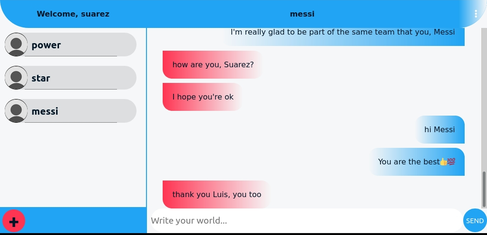

## 'Dark Mode'
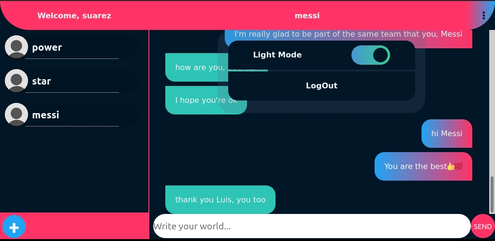

# Text.js
The next generation of online messaging (100% Mobile First).

## Abstraction
  Text.js an online messaging platform.
  
  => **Create a unique username, enter your email (for now, you can put anything you want, it doesn’t necessary work with a valid email at the moment) and put a _password with a minimum length of five (5) characters._**
	
  => Every session last five hours (5h) before you need to enter your credentials again.
	
  => You can change themes of the application between ‘dark’ and ‘light’ mode and the option will be stored in the browser through the localstorage API.

## Goals
	Share messages instantly through the platform.
	Create a JavaScript full stack application.
  
## Technologies and Methods
	React.js (Hooks).
	Responsive Design.
	Mobile First.
	Sass (CSS Pre-compiler).
	CSS variables.
	Local-Storage API.
	Node.js.
	Express.js.
	Socket.io (Web-sockets).
	Mongo DB (NoSQL).
	Mongoose.
	JSON Web Token (JWT).
	Bcrypt.js.
	DotEnv.
	Express-Validator.
	Rest API.
	Heroku Cloud Services.
	GIMP (to generate the images).
	InkScape (to generate the SVGs).
  
## Structure
  The server is hosted on Heroku and provides the endpoint to the frontend page that was made with React and is hosted on github pages.

  The server accepts and stores a new user data ( username, email, password ), new channel data ( username of the receiver, message ) and a new message. It connects all users on real time through socket.io that listens to new channels and messages and deliver it to the right user without interfering with the rest.

   The Mongo data base uses Mongoose to create schemas that link user to channels and channels to messages.
  
## Things to improve
   => Add profile pictures.
   
   => Add a search bar for existence users (by email and username).
    
   => Add date to the messages.
        
   => Show last message sent in the channel component and order the channels by date.
    
   => Add favorites (both messages and channels).
    
   => Only lowercase username.
    
   => Display server response.
    
   => Fix the error handling on the client and server (in the client side the errors that the server sends aren’t catch by the promises error handlers).
    
   => Add loading screen.
    
   => Fix the inner navigation on the landing page (the html ‘a’ tag).
    
   => Fix the overall design of the application.
    
   => Add the capacity of changing the wallpaper displayed on each channel.
    
   => Fix the nav-bar component by adding more separation of concerns (and the components associated to it).
    
   => Make the database queries more efficient (maybe even implementing a SQL database to the project).
    
   => Adding more layers of security to the server (specially the web-socket practices, and the CORS between server and client).
   
# Creative Process Through Images

## First Design of Text.js Ever!
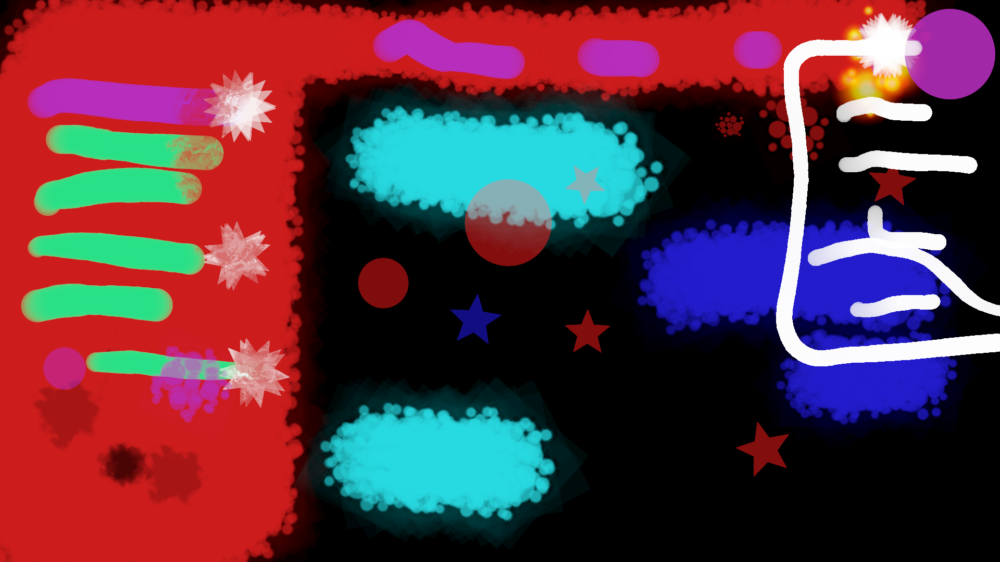

## First HTML Document!
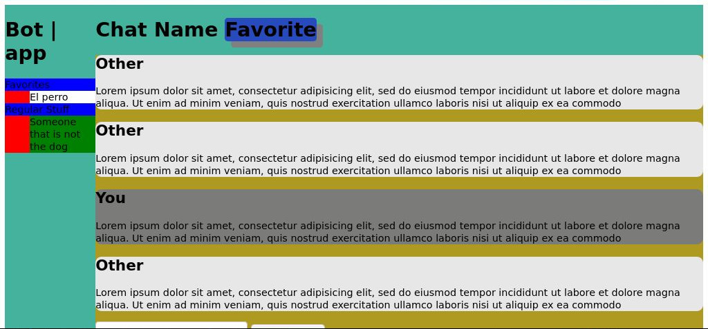

## First React Model of Text.js

## Playing with the colors and the channel's list

## Dummy data to test the Chat-Area component
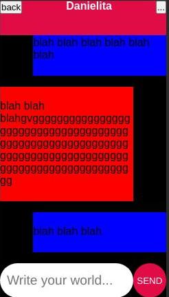

## An Identity Crisis...
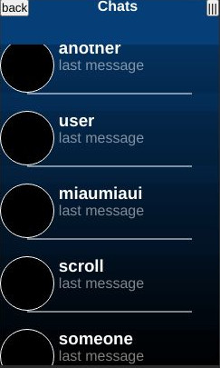

## Introducing the 'Dark Mode' into the application
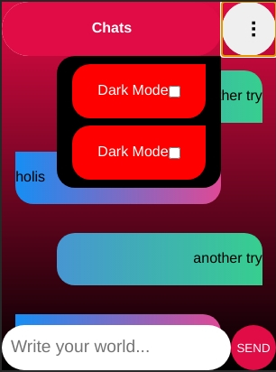

## New New-Message component

## Responsive design in the way
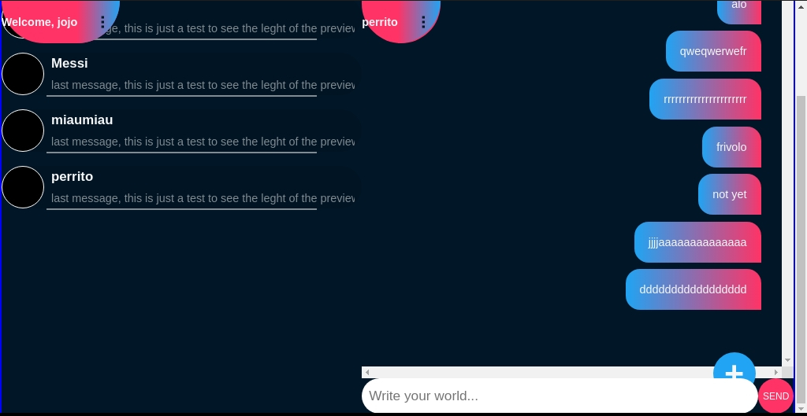

## Playing with the colors of the 'Light Mode'
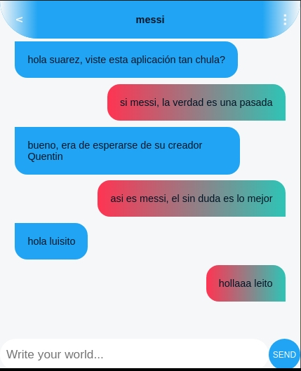

## Mobile First plus 'Dark Mode'
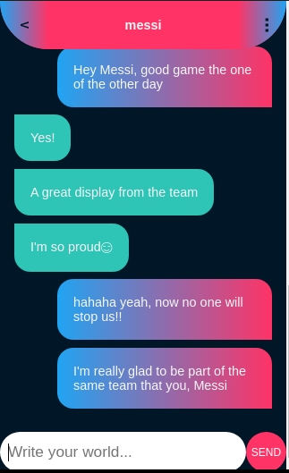

## Landing Page on mobile
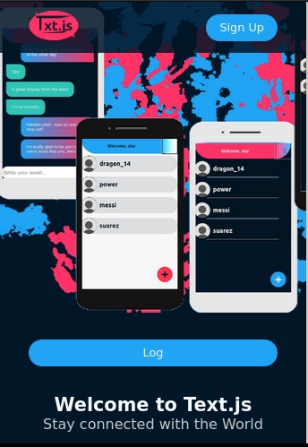

## 'Light Mode'

## 'Dark Mode'

